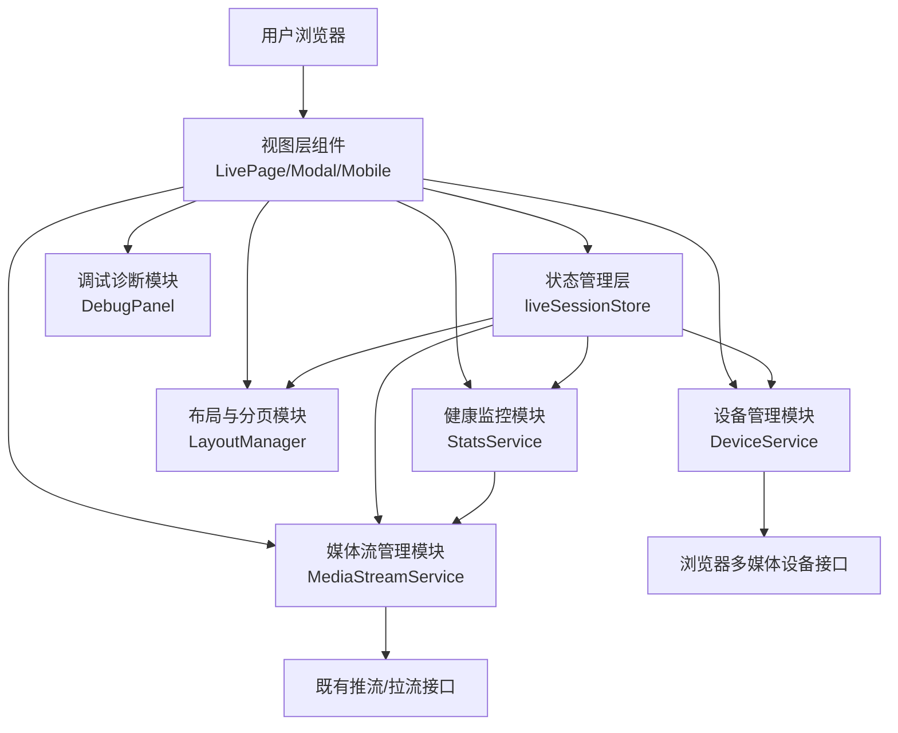
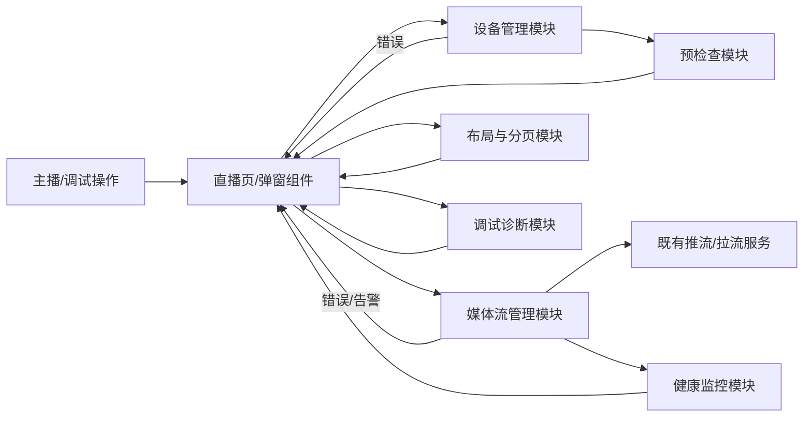

## Product Overview

一个面向主播端与调试人员的直播前端页面集，在保持现有推流、拉流能力稳定可用的前提下，系统化优化设备选择与预览、推流前检查弹窗、多路视频布局与分页、性能可视化、移动端体验及调试诊断能力，为用户提供更加直观、可控和流畅的直播体验。

## Core Features

- **设备选择与预览中心**
- 集中展示摄像头、麦克风、扬声器列表，支持搜索与默认设备标记。
- 预览区域以卡片式大画面呈现本地视频，边角显示分辨率、帧率等标签。
- 修复在检查弹窗中切换摄像头后预览总是停留在第一个摄像头的问题，确保切换立即反映在预览画面。

- **推流前检查弹窗升级**
- 弹窗采用分步流程：设备检查、网络与性能检测、结果总结三个阶段。
- 每一步使用醒目的通过/警告/错误状态标记和简洁文案，提供一键重试、快速切换设备等操作。
- 底部操作区通过按钮状态和提示文案明确当前是否已满足开播条件。

- **多路视频布局与分页**
- 主播端页面支持单路大画面与多路网格布局切换，自动根据窗口大小调整行列数。
- 当视频路数较多时，以分页形式展示，分页条吸附在画面下方，并显示当前页和总路数。
- 非当前页或非重点视频缩略显示或暂停渲染，以减轻性能压力。

- **视频流健康与性能可视化**
- 在主预览和多路视频区域上方叠加轻量级状态条，展示码率、延迟、丢包等关键指标。
- 略带渐变色的小图表实时滚动，正常状态使用柔和颜色，异常时以明显警示色突出。
- 健康状态以图标加文本形式提示（如“良好”“一般”“异常”），便于快速判断。

- **移动端直播体验优化**
- 移动端采用纵向布局，上方为主视频，下方通过底部滑出面板承载设备控制与互动入口。
- 控件尺寸更大、间距更舒适，重要操作按钮采用高对比色与固定底栏，防误触。
- 分页与布局切换改为滑动标签形式，便于单手操作。

- **调试与诊断面板**
- 通过按钮打开侧边或底部调试面板，展示按时间排序的关键事件与错误日志。
- 提供实时统计卡片、环境信息概览及一键复制、导出日志等功能。
- 面板采用半透明卡片叠加在页面一侧，不遮挡直播核心区域，同时保持整体视觉风格一致。

## Tech Stack

- 前端框架：Vue（沿用现有项目）
- 语言：JavaScript（推荐在新模块中逐步引入 TypeScript 类型）
- 状态管理：Vuex 或 Pinia（保持与现有项目一致）
- 样式：现有样式体系基础上，通过布局与组件级改造实现视觉升级与响应式适配
- 媒体与设备：浏览器 MediaDevices 与 MediaStream API
- 测试：单元测试 + 组件测试 + Playwright 端到端测试（重点覆盖设备操作与布局行为）

## System Architecture

前端采用 MVVM + 组件化分层，将设备管理、媒体流控制、布局分页、健康监控与调试诊断解耦，通过统一状态管理与事件总线与既有推流、拉流逻辑对接，确保不破坏核心功能。



## Module Division

### 1. 设备管理模块（DeviceService）

- **职责**：统一列举、选择摄像头/麦克风/扬声器；管理设备选中状态；生成预览用媒体流；修复摄像头切换预览问题。
- **关键点**：缓存设备列表；封装获取权限与错误处理；对外暴露订阅接口。
- **依赖**：状态管理层、媒体流管理模块。
- **接口示例**：
- `listDevices(): Promise&lt;MediaDeviceInfoExt[]>`
- `setVideoDevice(deviceId: string): Promise<void>`
- `createPreviewStream(opts): Promise<MediaStream>`

### 2. 媒体流管理模块（MediaStreamService）

- **职责**：负责本地采集流的创建、切换与销毁；与既有推流/拉流控制逻辑对接。
- **关键点**：区分预览流与推流用流；切换设备时安全地停止旧轨道；不破坏当前推流。
- **依赖**：设备管理模块、既有推流接口。
- **接口示例**：
- `ensurePublishStream(config): Promise<MediaStream>`
- `switchTrack(kind, deviceId): Promise<void>`

### 3. 布局与分页模块（LayoutManager）

- **职责**：管理多路视频的布局模式（单路/网格）、分页逻辑与可见性，控制哪些视频需要渲染。
- **关键点**：根据容器尺寸与路数计算布局；对不可见视频降低刷新或暂停渲染。
- **依赖**：状态管理层、媒体流管理模块。
- **接口示例**：
- `getLayout(state): LayoutPlan`
- `setPage(pageIndex: number): void`

### 4. 健康监控模块（StatsService）

- **职责**：周期性采集推流统计数据，计算健康等级，并向 UI 提供订阅。
- **关键点**：控制采样频率；避免过多状态更新；面向 UI 提供简化后的指标。
- **依赖**：媒体流管理模块。
- **接口示例**：
- `startCollect(): void`
- `onStatsUpdate(cb: (s: StatsSummary) => void): Unsubscribe`

### 5. 推流前检查模块（PreflightCheck）

- **职责**：组织设备、网络/性能、环境等多项检查，驱动分步弹窗内容和状态。
- **关键点**：支持串行/并行检查；统一结果模型；与设备状态联动。
- **依赖**：设备管理模块、健康监控模块。
- **接口示例**：
- `runAllChecks(): Promise<CheckResult[]>`
- `getCheckSummary(results): CheckSummary`

### 6. 移动端体验与调试模块（MobileUX & DebugPanel）

- **职责**：提供移动端布局适配逻辑、特定交互（底部抽屉）、调试面板展示日志和环境信息。
- **关键点**：断点管理；与主布局解耦；调试面板不影响核心渲染。
- **依赖**：状态管理层、其他业务模块。

## Data Flow



- 用户操作先触发视图层组件，再调用相应业务模块。
- 预检查模块统一拉起设备检查与性能检测，将结果以结构化数据映射到弹窗 UI。
- 媒体流管理负责与既有推流/拉流服务交互，健康监控模块从中采集统计信息回流至 UI。
- 布局模块根据视频流列表与窗口尺寸计算布局，提供给视图层渲染。
- 调试模块订阅各模块事件，统一输出文本日志与指标。

## Core Directory Structure

```
project-root/
├── src/
│   ├── views/
│   │   └── live/
│   │       ├── LivePage.vue           # 主播端直播页
│   │       ├── PreflightModal.vue     # 推流前检查弹窗
│   │       └── DebugPanel.vue         # 调试诊断面板
│   ├── components/
│   │   ├── DeviceSelector.vue         # 设备选择区
│   │   ├── LocalPreviewCard.vue       # 本地预览卡片
│   │   ├── VideoGrid.vue              # 多路视频网格
│   │   ├── PaginationBar.vue          # 分页条
│   │   ├── HealthStatsBar.vue         # 健康状态条
│   │   └── MobileControlsDrawer.vue   # 移动端底部抽屉
│   ├── services/
│   │   ├── deviceService.ts
│   │   ├── mediaStreamService.ts
│   │   ├── layoutService.ts
│   │   └── statsService.ts
│   ├── store/
│   │   └── liveSession.ts
│   ├── utils/
│   │   └── mediaHelpers.ts
│   └── types/
│       └── live.d.ts
└── package.json
```

## Key Code Structures

```ts
export interface MediaDeviceInfoExt {
  deviceId: string;
  kind: 'audioinput' | 'audiooutput' | 'videoinput';
  label: string;
  isDefault?: boolean;
}

export interface LocalPreviewState {
  currentVideoDeviceId: string | null;
  currentAudioDeviceId: string | null;
  stream?: MediaStream;
  isChecking: boolean;
}

class DeviceService {
  async listDevices(): Promise<MediaDeviceInfoExt[]> {}
  async setVideoDevice(deviceId: string): Promise<void> {}
  async setAudioInputDevice(deviceId: string): Promise<void> {}
  async setAudioOutputDevice(deviceId: string): Promise<void> {}
  async createPreviewStream(): Promise<MediaStream> {}
  stopPreviewStream(): void {}
}
```

## Technical Implementation Plan

### 1. 设备选择与预览（含摄像头切换 Bug 修复）

1. **问题**：设备切换逻辑分散且状态不统一，导致预览始终指向第一个摄像头。
2. **方案**：以设备管理模块为单一入口，统一维护当前设备 ID，并为预览流单独管理 MediaStream。
3. **关键技术**：MediaDevices.enumerateDevices、getUserMedia、组件受控输入。
4. **步骤**

- 抽离设备管理逻辑到 DeviceService。
- 引入 `currentVideoDeviceId` 等集中状态，并在切换时更新。
- 切换设备时停止旧预览流轨道，基于新 deviceId 重建预览流。
- 预览组件仅通过状态驱动，不直接操作设备。

5. **挑战与规避**

- 快速切换导致并发调用：通过队列或节流控制，后触发覆盖前一次。
- 权限拒绝时保持旧流可用，并清晰提示。

### 2. 推流前检查弹窗重构

1. **问题**：检查流程不清晰，无法直观看到各项状态。
2. **方案**：按步骤拆分检查流程，统一结果模型，驱动多步弹窗 UI。
3. **关键技术**：Promise 链式控制、统一结果类型、状态映射。
4. **步骤**

- 定义 `CheckItem` 与 `CheckResult` 数据结构。
- 将设备/网络/性能检查封装为独立函数，统一由 PreflightCheck 调度。
- 弹窗组件按步骤展示，对应不同检查列表和结果。
- 根据汇总结果控制「开始直播」按钮可用状态及文案。

5. **挑战与规避**

- 检查耗时：对耗时较长项提供进度与取消选项。
- 部分失败时仍允许开播：通过“强制开播”选项并显式风险提示实现。

### 3. 布局与分页及性能优化

1. **问题**：多路视频同时渲染导致卡顿，布局缺乏规则。
2. **方案**：布局模块根据容器尺寸与路数计算布局，分页+可见性控制减少渲染压力。
3. **关键技术**：响应式布局算法、IntersectionObserver、条件渲染。
4. **步骤**

- 定义布局模式与分页规则（如桌面端默认 2x2，移动端单路）。
- 布局模块根据视口与路数输出每路视频的尺寸与是否显示。
- 对非当前页视频暂停绘制或仅保持音频。
- 在滚动或分页切换时使用 IntersectionObserver 控制播放状态。

5. **挑战与规避**

- 切页造成音频中断：分页主要控制画面渲染，不打断重要音频源。
- 布局闪烁：过渡中使用动画与延迟切换减少跳变。

### 4. 移动端布局与交互

1. **问题**：当前移动端布局未针对小屏优化，操作易误触。
2. **方案**：为移动端定义独立布局结构与交互模式（主视频+底部抽屉）。
3. **关键技术**：媒体查询、基于窗口宽度的条件渲染、手势交互。
4. **步骤**

- 定义断点，区分桌面与移动布局。
- 移动端采用纵向布局，顶部固定主视频，中下部分为抽屉式控制区域。
- 扩大关键按钮触控区域，引入双确认对危险操作。
- 针对横竖屏切换调优布局与控件位置。

5. **挑战与规避**

- 不同设备分辨率适配：采用相对单位与灵活网格。
- 与原有样式冲突：新布局通过独立容器与样式前缀隔离。

### 5. 调试与健康监控

1. **问题**：线上问题排查难，缺乏统一可视化指标与日志。
2. **方案**：增加调试面板与轻量健康展示层，统一采集与展示事件和指标。
3. **关键技术**：事件总线、轻量图表渲染、日志缓冲。
4. **步骤**

- 设计调试事件模型，业务模块在关键节点派发事件。
- 健康监控模块周期性采集统计信息并计算等级。
- 调试面板展示事件时间线、当前关键指标与环境信息。
- 提供复制/导出日志能力，便于反馈与分析。

5. **挑战与规避**

- 调试面板本身造成性能负担：默认关闭，采集频率可配置。
- 数据量过大：对事件做采样和数量限制。

## Integration Points

- 与既有推流/拉流控制模块保持接口兼容，通过适配器模式封装新旧调用。
- 预检查结果与推流入口联动，仅通过状态控制按钮与提示，不直接修改底层推流逻辑。
- 调试模块仅订阅事件与状态，不影响原有业务流程。

## Performance Optimization

- 设备列表缓存与差异更新，避免频繁 enumerateDevices。
- 预览与推流流分离，切换设备仅更新预览流，推流流在确认后才更新。
- 多路视频通过布局与分页控制渲染数量，非重点流降帧或暂停绘制。
- 健康监控采样频率可配置，避免高频状态更新。
- 使用防抖/节流控制窗口 resize 与滚动导致的布局重算。

## Security Measures

- 严格根据用户操作触发设备权限请求，不在页面加载时立刻申请。
- 避免将完整设备 ID 等敏感信息写入外部日志。
- 在调试日志中隐去房间号、用户 ID 等敏感业务字段。

## Scalability

- 模块化设计便于后续扩展新检查项、新布局模式或其他终端形态。
- 布局和分页规则参数化，可针对大班课、连麦房间等场景调整。
- 健康监控模块可扩展更多统计项或接入后端监控。

## Development Workflow

- 建议以功能分支方式开发：设备管理与预览、预检查弹窗、布局与分页、移动端、调试面板分批上线。
- 使用组件和服务层单元测试保障关键逻辑稳定。
- 使用 Playwright 编写端到端用例覆盖设备切换、预检查流程、布局分页交互。
- 在灰度阶段开启调试面板与日志导出功能，支持快速回滚。

## 设计风格

- 整体采用深色玻璃拟物风格，结合蓝紫渐变与柔和光晕，突出“专业直播控制台”氛围。
- 主要操作与关键指标采用高对比度强调色，搭配适度阴影与模糊背景，营造层次感。
- 所有交互带有轻微动效：按钮点击、分页切换、卡片悬浮均使用 150–250ms 的平滑过渡。
- 通过响应式栅格和断点设计，保证桌面与移动端均有专属布局，而非简单缩放。

## 页面规划与块设计

### 1. 主播端直播控制台（桌面端）

- **顶部导航栏**：左侧为 Logo 和房间标题，中间显示直播状态灯（未开始/检查中/直播中），右侧提供返回与帮助入口。
- **设备与预览区域**：左侧纵向卡片列出摄像头、麦克风、扬声器，选中项高亮；右侧为大号本地预览卡片，叠加分辨率、帧率、小型健康指示点。
- **推流控制与健康栏**：居中展示开始/停止按钮，左右两侧为码率、延迟、丢包的迷你折线图与数值，背景使用轻微渐变突出关键数据。
- **远端视频布局与分页区**：网格卡片自适应排列，鼠标悬停时显示流名和静音控制；底部分页条居中，采用圆角标签与滑动指示条。
- **底部工具栏**：横向排列静音、关闭摄像头、屏幕分享、调试面板开关等图标按钮，采用半透明底栏与模糊背景，始终悬浮固定。

### 2. 推流前检查弹窗

- **弹窗顶部栏**：标题「开播前检查」居中，右侧是关闭按钮；下方以进度条或步骤条展示当前步骤和总步骤数。
- **设备检查区**：分三列展示摄像头、麦克风、扬声器，每列为卡片列表，当前选中设备置顶；右侧小预览窗实时展示视频，并随选择即时切换。
- **网络与性能检测区**：以卡片形式展示网络延迟、带宽、丢包等，使用颜色明确通过与告警，必要时给出简短建议。
- **问题提示与快速修复区**：列表展示检测出的问题，每项提供图标、简短描述和“更换设备”“重试检测”等按钮。
- **底部操作条**：左侧“上一步”，中间“下一步”，右侧“开始直播”或“仍然开播”按钮，根据检查结果变更颜色与启用状态。

### 3. 移动端直播页

- **顶部导航栏**: 收窄高度的顶栏，左侧返回，中部标题，右侧网络与人数图标，颜色与桌面端保持统一。
- **主视频预览区**：占据上半屏的 16:9 圆角卡片，画面上方半透明条显示码率和帧率，点击可展开更多统计。
- **设备与互动滑出面板**：自底部上滑出现，包含设备切换、麦克风开关、前后摄像头切换、弹幕开关等，采用大图标与清晰文字标签。
- **分页与布局切换条**：紧贴主视频下方的横向标签条，支持左右滑动切换不同嘉宾或布局，指示条以渐变色强调当前项。
- **底部主操作栏**：固定底部的大按钮区域，突出“开始/结束直播”，旁边放置调试开关与视图锁定等次要操作。

### 4. 调试与诊断面板

- **顶部工具栏**：展示面板标题和显示模式（简洁/详细）切换，以及折叠按钮，使用清晰的分隔线区分层级。
- **日志时间线区域**：采用垂直时间线样式显示事件节点，左侧为时间，右侧为简短内容和标签，可按类型筛选。
- **实时统计卡片区**：多张小卡片展示当前码率、延迟、丢包等关键数据，卡片底部叠加简单趋势线，错误状态以醒目的红橙色显示。
- **环境信息与导出区**：展示浏览器、操作系统、设备信息等，以两列表格排布，并提供明显的“复制信息”“导出日志”按钮。
- **底部导航栏**：与主页面底栏保持样式一致，仅增加“关闭面板”图标，确保导航体验统一。

## Agent Extensions

### SubAgent

- **code-explorer**
- **Purpose**: 在现有 Vue 工程中快速定位直播页、设备管理、推流前检查及布局相关代码与依赖关系。
- **Expected outcome**: 形成清晰的组件树与服务模块调用图，为安全改造提供依据。

### MCP

- **sequential-thinking**
- **Purpose**: 对直播页优化进行分阶段拆解和顺序推演，确保每一步对核心推拉流影响可控。
- **Expected outcome**: 一份经过推理验证的分期实施与回滚策略清单。

- **Figma MCP**
- **Purpose**: 协同创建和迭代直播控制台、检查弹窗、移动端页的高保真原型与交互稿。
- **Expected outcome**: 与实现保持一致的 UI 设计文档，降低返工风险。

- **playwright**
- **Purpose**: 为设备切换、预检查流程、布局分页和移动端交互建立自动化端到端回归测试。
- **Expected outcome**: 可重复执行的测试集，验证每次改动不破坏推流/拉流与关键交互。

### Skill

- **skill-creator**
- **Purpose**: 定义专门用于 WebRTC 直播故障排查的技能模板和操作流程。
- **Expected outcome**: 一套可复用的排障技能，支持快速分析日志与定位问题。